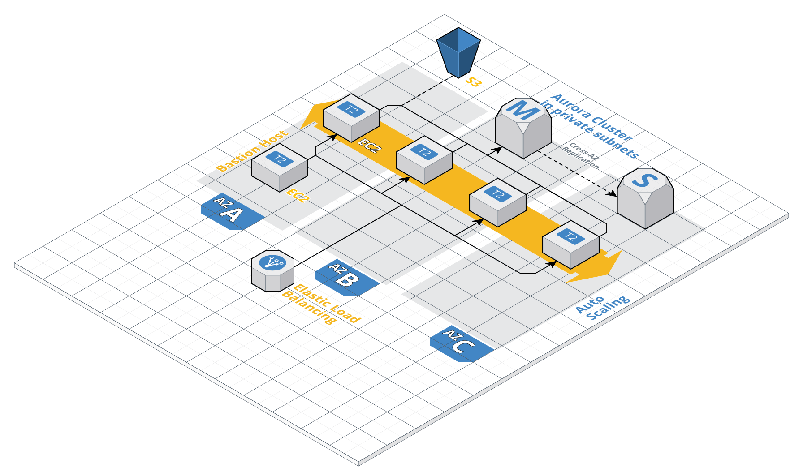

# Terraform script to build a resilient WordPress website in AWS ![version][version-badge]

[version-badge]: https://img.shields.io/badge/version-1.0.0-blue.svg

With this terraform script you can create a resilient WordPress website.

The architecture is composed by:

- WordPress instances that are part of an autoscaling group which spans in three public subnets. The autoscaling group uses an autoscaling policy based on the CPUUtilization CloudWatch alarm (if it's >=  80%, adds one more instance). Each EC2 instance is provisioned with nGINX as web-server and PHP 7.0. When the bastion-host is created, a user with permissions to access the WordPress db is created. 
- Aurora clusters that live in private subnets
- Bastion host (EC2 instance) to provide SSH access to the instances in the autoscaling group (if needed)
- S3 bucket which is used to keep syncronized the instances by storing the wp-content contents
- ELB to manage the connections to the instances in the autoscaling group

## Terraform script variables

You must specify the following variables before executing the Terraform script:

- **aws_profile**: Your AWSCLI profile
- **aws_key_name**: The key pair name
- **aws_public_key_path**: The absolute path where the public part of the key pair is stored
- **aws_private_key_path**: The absolute path where the private part of the key pair is stored
- **db_master_username**: Username of the master user of the Aurora cluster
- **db_master_password**: Password of the master user of the Aurora cluster
- **db_username**: Username of the user with full privileges on the WordPress database
- **db_password**: Password of the user with full privileges on the WordPress datagbase
- **db_instance_size**: Autoscaling group instances size
- **ssh_cidr**: CIDR block address from where the SSH access to the bastion host is allowed (it's a list)

## Architecture diagram

